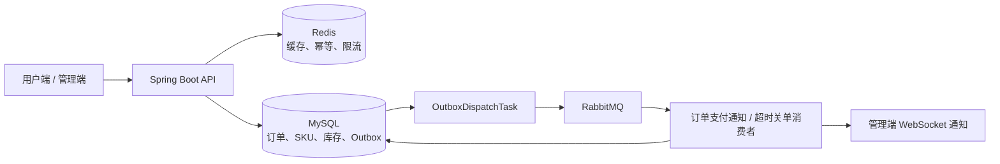
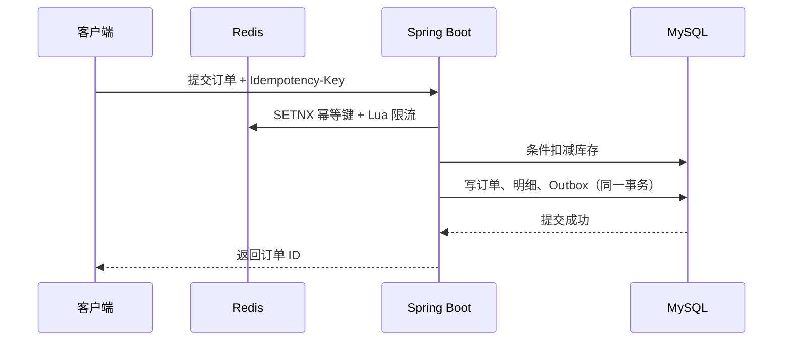

# 悦选本地到家服务平台

> 面向社区即时零售与到家服务场景的全栈项目。用户可浏览商品与服务、选择 SKU、购买组合商品或限时购，并完成配送、自提或预约上门；运营端可维护商品、服务组合、订单履约和经营数据。

本仓库从餐饮点单练习项目持续演进而来，当前已完成订单状态机、支付与下单幂等、SKU 库存、Redis Cache Aside 与 Lua 限流、RabbitMQ 超时关闭、Outbox 可靠投递、限时购和组合商品闭环。所有业务迭代均以“悦选本地到家服务平台”为产品主题。

用户端和管理端均已完成悦选本地到家服务平台的主题、商品/服务文案、交易流程与接口适配。用户端当前位于 [`frontend/legacy-mp-weixin`](frontend/legacy-mp-weixin)，可用于运行和演示；该目录为历史 uni-app 小程序构建产物，课程资料未包含原始 `.vue` 源码。后续如需持续迭代前端页面，将在 `frontend/yuexuan-miniprogram` 中重建可维护的源码工程。

数据库从 [`sql/sky_take_out_schema.sql`](sql/sky_take_out_schema.sql) 初始化后，再按 [`sql/migrations/`](sql/migrations/) 中的版本顺序执行增量脚本。迁移脚本保留了课程项目早期的重复版本号命名，因此当前采用**人工、按文件名与说明顺序执行**，并未接入 Flyway 自动迁移；执行前请先备份本地数据库。具体顺序见本文“快速启动”。

## 产品定位

悦选服务周边社区，提供日用百货、生鲜果蔬、乳品烘焙、家庭清洁、宠物用品、鲜花绿植、健康护理等即时零售商品，以及可预约的本地到家服务。平台围绕“商品/服务选择 → 购物车 → 下单支付 → 门店接单 → 配送、自提或上门履约”构建交易闭环。

当前版本的餐饮领域对象暂作为通用交易模型使用：

| 当前实现名称 | 悦选平台中的业务含义 | 后续演进方向 |
| --- | --- | --- |
| 菜品（Dish） | 标准化商品或服务项目 | 统一为商品（Product） |
| 口味（DishFlavor） | 商品规格/服务选项 | 统一为 SKU 规格 |
| 套餐（Setmeal） | 商品组合或服务套餐 | 统一为组合商品（Bundle） |
| 店铺（Shop） | 门店或服务站点 | 支持多门店、服务范围与营业时间 |
| 派送订单 | 本地配送/上门履约订单 | 支持配送与预约上门两种履约方式 |

这是有意保留的渐进式改造：先复用稳定交易主链路，再逐步替换领域模型，而不是为了改名一次性破坏已有接口和数据。

## 当前功能

### 运营端

- 运营人员登录、账号、密码与状态管理
- 工作台数据概览：交易额、有效订单、用户与商品统计
- 商品、规格、组合商品、分类的维护与上下架
- 门店营业状态管理
- 订单查询、接单、拒单、取消、配送与完成履约
- 交易额、用户、订单、销量 Top10 等经营报表
- 商品图片上传至阿里云 OSS
- 通过 WebSocket 接收新订单提醒

### 用户端

- 微信小程序登录与 JWT 鉴权
- 商品、服务组合、分类浏览
- 商品列表采用 Cache Aside：Redis 命中直接返回；未命中回源 MySQL 并以随机 TTL 回填缓存
- 普通商品库存管理：下单时通过 MySQL 条件更新原子扣减库存，库存不足或商品下架时拒绝创建订单
- 商品 SKU：支持规格名称、规格值、独立售价、独立库存与上下架；购物车和订单明细保留 SKU 及规格快照
- 购物车添加、减少和清空
- 常用服务地址管理与默认地址设置
- 提交订单、模拟支付、订单详情与历史订单
- 催单、再次购买
- 门店营业状态查询

## 核心架构与可靠性设计



下单主路径以 MySQL 事务为最终一致性边界：Redis 先做短期幂等与限流，库存使用条件更新扣减；订单、明细、库存变更与 Outbox 事件一起提交。异步消费者可以重复收到消息，但以事件 ID 幂等和订单状态条件更新避免重复执行业务。



## 已知限制

- 用户端与管理端均已完成悦选主题和交易流程适配。`frontend/legacy-mp-weixin` 是历史 uni-app 小程序构建产物，不包含可维护的 `.vue` 源码；当前可用于运行和演示，但后续新增页面或进行大规模迭代时，需要在 `frontend/yuexuan-miniprogram` 中重建可维护的前端源码工程。
- 后端仍沿用 `dish`、`setmeal`、`dish_flavor` 等课程项目表名和部分包名作为兼容层；对外业务含义分别是商品、组合商品和规格元数据。
- 数据库增量脚本尚未接入 Flyway；首次搭建与升级需要按文档人工执行并记录已执行版本。
- OSS、微信真实支付与真实小程序 AppID/证书依赖外部账号配置；本地开发使用 mock 登录和模拟支付链路验证。

## 下一阶段计划

1. 重建可维护的悦选小程序源码工程：保留当前已完成的悦选用户端演示与接口能力，逐步从历史构建产物迁移到 `frontend/yuexuan-miniprogram`，降低后续页面迭代成本。
2. 接入 Flyway 或 Liquibase，统一管理数据库版本与执行记录。
3. 完善配送员、服务范围、售后退款、评价与优惠能力。
4. 为 RabbitMQ DLQ、Outbox 长时间重试和库存异常增加监控与告警。

## 交易可靠性

订单状态由 Service 层统一控制，不能通过通用更新接口任意修改：

```text
待支付 -> 待接单 -> 已接单 -> 配送中 -> 已完成
   |         |          |
   +-------> 已取消 <----+
```

- 支付仅允许将待支付订单变为待接单；运营人员只能按规定顺序接单、配送和完成履约。
- 用户仅能取消待支付或待接单订单，且只能取消自己的订单。
- 每次状态更新均使用 `WHERE id = ? AND status = ?` 条件更新，避免并发请求覆盖新状态。
- 支付成功处理具有幂等性：重复支付请求或回调只会首次更新订单并发送来单提醒。
- 下单接口要求请求头 `Idempotency-Key`：Redis 用 `SETNX` 拦截短时重复请求；订单表用 `(user_id, submit_request_id)` 联合唯一索引提供最终兜底。重复请求会返回第一次创建的订单。
- 下单接口使用 Redis Lua 脚本做按用户固定窗口限流：同一用户 60 秒内最多提交 5 次。Lua 将计数与设置过期时间原子执行；触发限流时返回“操作过于频繁，请稍后再试”。限流是流量保护，幂等是重复请求保护，二者互补。
- 商品浏览缓存使用 `yuexuan:v2:product:list:{categoryId}` 规范 Key；运营端商品新增、编辑、上下架和删除时精确删除受影响分类缓存，不使用 Redis `KEYS` 通配符扫描。`v2` 用于隔离旧餐饮演示数据缓存。
- 普通商品库存使用 `UPDATE ... SET stock = stock - ? WHERE stock >= ? AND status = 1` 条件更新，避免并发下单超卖；库存扣减与创建订单位于同一事务中。
- 选择 SKU 的商品下单时优先扣减 SKU 库存；订单明细保存 `skuId` 与规格快照，避免后续规格变更影响历史订单展示。
- 每个 HTTP 请求会携带或生成 `X-Trace-Id`，该值写入日志 MDC 并原样返回响应头。可按 `traceId` 串联“请求开始、鉴权、限流、订单、支付、异常”等同一次请求的日志；非法请求头不会直接写日志，避免日志污染。
- 创建订单和支付成功会在同一个本地事务内写入 `outbox_event`；后台投递器可靠发布 RabbitMQ 消息，消费者以 `eventId` 幂等处理。详见 [`docs/project-delivery-and-demo-guide.md`](docs/project-delivery-and-demo-guide.md)。

## 技术栈

| 层次 | 技术 |
| --- | --- |
| 基础框架 | Spring Boot 2.7.3、Spring MVC |
| 持久层 | MyBatis、PageHelper、MySQL |
| 缓存与状态 | Redis、Spring Cache |
| 安全 | JWT（运营端与用户端独立密钥） |
| 文件存储 | 阿里云 OSS |
| 接口文档 | Knife4j / Swagger |
| 实时通信 | WebSocket |
| 测试 | JUnit 5、Mockito |
| 构建工具 | Maven、JDK 17 |

## 项目结构

```text
yuexuan-local-service/
├── .github/workflows/               # GitHub Actions 持续集成
├── docs/                            # 交付说明、演示流程、面试笔记
├── frontend/                        # 已完成悦选适配的用户端与管理端前端
├── sky-common/                      # 公共配置、工具类、常量、异常、结果封装
├── sky-pojo/                        # Entity、DTO、VO 等业务对象
├── sky-server/                      # Spring Boot 启动模块、Controller、Service、Mapper
├── sql/                             # 建表脚本与增量迁移脚本
├── .env.example                     # 本地依赖环境变量模板
├── docker-compose.yml               # MySQL、Redis、RabbitMQ 本地依赖
└── pom.xml
```

> `sky-*` 目录和 `com.sky` 包名是历史技术标识，当前暂不影响对外产品名称或运行。待商品模型、门店模型重构时会以小步提交逐步替换，避免大规模重命名造成回归。

## 环境要求

- JDK 17
- Maven 3.6+
- MySQL 8.0
- Redis 7+
- Docker Desktop / Docker Compose（推荐，用于一键启动本地依赖）
- RabbitMQ 3.x（使用 Docker Compose 时无需单独安装）
- 可选的外部账号配置：阿里云 OSS、微信小程序与微信支付真实链路

## 快速开始

### 1. 启动本地依赖

项目提供 Docker Compose，用于启动 MySQL 8.0、Redis 7 和 RabbitMQ。复制环境变量模板并填写仅用于本地开发的依赖密码：

```bash
cp .env.example .env
docker compose up -d
docker compose ps
```

首次初始化时，Docker Compose 会启动 MySQL、Redis 和 RabbitMQ。为避免干扰本机已有的 MySQL / Redis，MySQL、Redis、RabbitMQ AMQP 与 RabbitMQ 管理台分别映射到本机 `3307`、`6380`、`5672`、`15672`；容器内部 MySQL / Redis 端口仍为 `3306` / `6379`。若端口已被占用，请调整 `docker-compose.yml`，并同步更新本机 `application-dev.yml`。

### 2. 初始化数据库

项目提供 `sql/sky_take_out_schema.sql`，用于创建 `yuexuan_local_service` 本地开发数据库及基础表结构：

```bash
mysql -u root -p < sql/sky_take_out_schema.sql
```

使用 Docker Compose 首次启动时，基础 Schema 会自动挂载到 MySQL 初始化目录。后端启动时 Flyway 会读取 `sky-server/src/main/resources/db/migration/`，建立 `flyway_schema_history` 并自动执行尚未应用的升级脚本。不要再把该目录中的脚本逐个手工执行。

当前已有的 Docker 演示库已经完成历史 V2～V23 迁移：本机 `application-dev.yml` 应设置 `spring.flyway.baseline-version: 23`，Flyway 只会写入基线记录，不会重跑历史 SQL。全新 Docker 库使用 `baseline-version: 0`，会在基础 Schema 之上自动执行 V2.1～V23。

`sql/migrations/` 保留为历史迁移参考；Flyway 自动执行目录中的 V2.1、V2.2、V3.1、V3.2 将早期重复版本号转为唯一版本。以下清单仅用于理解历史顺序：

```text
V2__yuexuan_product_domain.sql
V2__add_order_submit_idempotency.sql
V3__add_product_stock.sql
V3__yuexuan_demo_catalog.sql
V4__add_product_sku.sql
V5__rebuild_yuexuan_browse_catalog.sql
V6__clear_legacy_transaction_history.sql
V7 ～ V10、V12 ～ V23：按文件名前缀升序执行
```

> `V6__clear_legacy_transaction_history.sql` 不在 Flyway 自动目录中。它会清理课程演示交易记录，只能在全新演示库且确认无需保留交易数据时由开发者手工执行；已有演示数据时绝不能执行。

### 3. 配置开发环境

复制 `sky-server/src/main/resources/application-dev.yml.example` 为 `application-dev.yml`，再填写本地服务和第三方服务的真实配置。不要将密码、AccessKey、微信私钥或证书提交到 Git。

```yaml
sky:
  datasource:
    host: localhost
    port: 3307
    database: yuexuan_local_service
    username: root
    password: your-password
  redis:
    host: localhost
    port: 6380
    password:
    database: 0
```

### 4. 测试、编译与启动

在项目根目录执行：

```bash
mvn test
mvn clean package
mvn -pl sky-server -am spring-boot:run
```

服务默认监听 `http://localhost:8080`；接口文档地址为 `http://localhost:8080/doc.html`。管理员端接口通常以 `/admin` 开头，用户端接口通常以 `/user` 开头。

RabbitMQ 管理台为 `http://localhost:15672`，账号密码来自 `.env` 的 `RABBITMQ_DEFAULT_USER` 和 `RABBITMQ_DEFAULT_PASS`。`mvn test` 当前以 Mockito 单元测试为主，不要求本地 MySQL、Redis、RabbitMQ 或 WebSocket 容器运行；完整接口演示仍需要启动上述依赖。

Flyway 成功执行后可在目标数据库检查迁移历史：

```sql
SELECT installed_rank, version, description, script, success
FROM flyway_schema_history
ORDER BY installed_rank;
```

## 演示入口

- 后端接口文档：[http://localhost:8080/doc.html](http://localhost:8080/doc.html)
- RabbitMQ 管理台：[http://localhost:15672](http://localhost:15672)
- 用户端：[`frontend/legacy-mp-weixin`](frontend/legacy-mp-weixin)，已完成悦选主题与接口适配；使用微信开发者工具打开并重新编译该构建产物进行演示。
- 管理端：[`frontend/admin-vue-ts`](frontend/admin-vue-ts)。构建并由本地 Nginx 部署后，当前本地演示入口为 [http://localhost:90/](http://localhost:90/)；登录、商品、组合、订单和限时购操作依赖后端服务运行。

## 后续演进路线

1. **多商品/多 SKU 组合库存**：支持一次组合购买原子扣减多个商品或 SKU，并完善取消订单后的库存回补校验。
2. **多门店与服务范围**：支持门店营业时间、配送半径、服务区域和商品可售范围。
3. **履约能力**：支持配送方式、预约时间窗、配送员接单和履约轨迹。
4. **营销与售后**：支持优惠券、满减、退款、评价与投诉。
5. **工程化增强**：引入 Flyway 或 Liquibase；为 RabbitMQ DLQ、Outbox 长时间重试、库存异常补充监控、告警与处理台账。
6. **前端源码工程**：将当前已完成的悦选用户端演示能力逐步迁移到可维护的源码工程。

## 开发约定

- 提交前执行 `mvn test`；外部 OSS、HTTP、Redis 演示测试已标记为手动检查，不在默认构建中运行。
- 新增交易状态必须通过 Service 层和状态机控制，避免 Controller 直接更新数据库。
- 新增下单类接口必须考虑幂等、并发更新和事务边界。
- 数据库、Redis、OSS 和微信配置必须按环境隔离，敏感信息不得提交到 Git。

## 许可证

本项目目前未声明开源许可证。若用于商业分发或二次发布，请先与仓库维护者确认授权范围。
